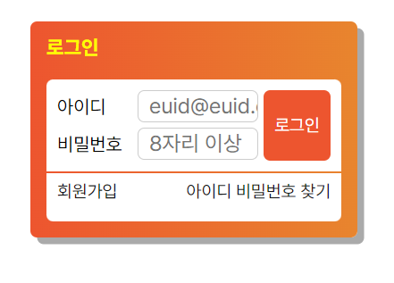

# Mission-02
## General Info
Position 실습을 위한 과제

## 결과물

## Description

멋쟁이 사자처럼 프론트엔드 스쿨에서 제공한 webcafe 홈페이지 시안 중 로그인 영역

* 구성 : body -> box wrapper -> h2:login-text + form:login-form -> login-wrapper + div:option-group

* 기술을 사용한 이유

    * theme.css 사용 : 홈페이지 유지보수의 편리성을 위함

    * `<legend>로그인 페이지</legend>`

        `<legend>회원가입, 아이디 비밀번호 찾기</legend>` : 접근성 개선을 위함

        CSS 를 걷어내고 본 결과, 중복되는 텍스트가 있어 `<legend>회원가입, 아이디 비밀번호 찾기</legend>` 가 불필요하다고 판단, 삭제

    * `box-sizing: border-box;` : 전체 박스의 크기가 padding, margin 값에 영향 받지 않게 하기 위함

    * `.id-input-label, .ps-input-label {display: inline-block;}` : 입력 칸 정렬을 위함

    * `box-wrapper` 안에서의 `login-wrapper`, `opstion-group`의 위치 조절을 위해 position 값 사용

    *  option-group 내에 join, find 의 정렬을 위해 각각 `float:left;` `float:right;` 값을 줌

*  개선하고 싶은 점

    * `login-wrapper`과 `option-group` 사이의 여백 없애고 회색 `border-line` 넣기

    * `join`(회원가입), `find`(아이디 비밀번호 찾기) 의 위치값 조절