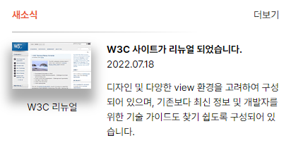

# mission-04 과제 
### Grid 속성의 활용법을 복습하며 이해도를 확인하기 위한 과제물입니다.
---

<br>

- ### 완성본



<br>

- ### Markup 작성

```
body > main

    > section.news

        > header.news-text

        > div.plus

        > div.border

        > div.img-wrapper
            > img.thumbnail
            > img-title
        
        > div.text-wrapper
            > div.title
            > span.date
            > p.description
```
총 5개의 grid-area 를 사용하기 위한 마크업 구조 

<br><br>

- ### CSS 작성

<br>부모요소 ( container ) 인 section.news 에 grid 속성값을 설정<br>
총 10개의 세로줄 사용<br>
grid-template-areas 로 위치를 바로 파악할 수 있게 작성
<br>
<br>

```CSS
.news{
    display: grid;
    grid-template-columns: repeat(10, 1fr);
    grid-template-rows: auto;
    grid-template-areas: 
    "news-txt . . . . . . . . plus"
    "border border border border border border border border border border"
    "img-wrap img-wrap img-wrap txt-wrap txt-wrap txt-wrap txt-wrap txt-wrap txt-wrap txt-wrap"
    ;
}
```
<br>

각각의 자식요소들에게 grid-area 속성을 이용해 이름을 부여

<br>

```CSS
.news-text{
    grid-area: news-txt;
}

.plus{
    grid-area: plus;
}

.border{
    grid-area: border;
}

.img-wrapper{
    grid-area: img-wrap;
}

.text-wrapper{
    grid-area: txt-wrap;
}
```