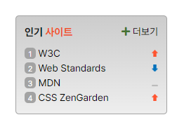

# mission-05 과제 
### Sprite image 기법의 활용법을 복습하며 이해도를 확인하기 위한 과제물입니다.
---

<br>

- ### 완성본



<br>

- ### Markup 작성

```
body > main

    > section. popular

        > header. popular__title
            > span. orange
        
        > ol. popular__list
            > li. popular__item
            > a
            > span.sprite sprite-up

            > li. popular__item
            > a
            > span.sprite sprite-down

            > li. popular__item
            > a
            > span.sprite sprite-draw

            > li. popular__item
            > a
            > span.sprite sprite-up
        
        > a. popular__more
            > span. fas fa-plus

```

세 가지 종류의 아이콘을 `sprite-up`, `sprite-down`, `sprite-draw` 로 구분해 리스트에 쓰인 이미지의 class 값을 다르게 줌

<br><br>

- ### CSS 작성

<br>

```CSS
.sprite{
    background: url(./imgs/rank.png) no-repeat;
    margin-top: 5.5px;
    float: right;
}
```

sprite 전체 class의 배경을 설정하고 위치 맞춰줌

```CSS
.sprite-up{
    background-position: 0 0px;
    width: 9px;
    height: 9.5px;
}

.sprite-down{
    background-position: 0 -45px;
    width: 9px;
    height: 9.5px;
}

.sprite-draw{
    background-position: 0 -18px;
    width: 9px;
    height: 9.5px;
}
```
위 화살표, 아래 화살표, 변화없음 선 각각의 위치 설정